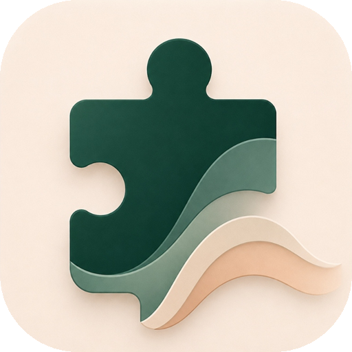

<p align="center">
  
  <h1 align="center">Jigsaw Flow</h1>
  <p align="center">Professional desktop jigsaw puzzle studio built with Electron, React, TypeScript, and HTML5 Canvas.</p>
</p>

---

## 📥 Installation (Windows)

### Option 1: Setup Installer (Recommended)
1. Download or build [`Jigsaw Flow-Setup-1.0.0.exe`](release/Jigsaw%20Flow-Setup-1.0.0.exe).
2. Run the installer. No admin permissions (UAC) required.
3. Launch from your Desktop or Start Menu.

### Option 2: Portable Executable
Run [`release/win-unpacked/Jigsaw Flow.exe`](release/win-unpacked/Jigsaw%20Flow.exe) directly without installing.

---

## 🛠️ Build from Source

### Prerequisites
- [Node.js](https://nodejs.org/) (v18+)

```bash
# Clone & install
git clone https://github.com/KHOJAH/Jigsaw-Flow.git
cd Jigsaw-Flow
npm install

# Run dev mode
npm run dev

# Build Windows installer (.exe)
npm run dist
```

---

## 🎮 Controls

| Action | Shortcut |
| :--- | :--- |
| **Pan Canvas** | `Space + Drag` or `Middle Click + Drag` |
| **Zoom** | `Mouse Wheel` (cursor-anchored) |
| **Rotate Piece / Group** | `R` or `Double Click` |
| **Toggle Organizer Tray** | `T` |
| **Smart Hint** | `H` |
| **Multi-Select** | `Shift + Drag` (Marquee Box) |

---

## 📄 License
MIT