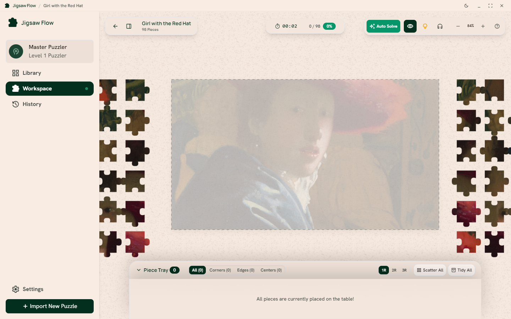
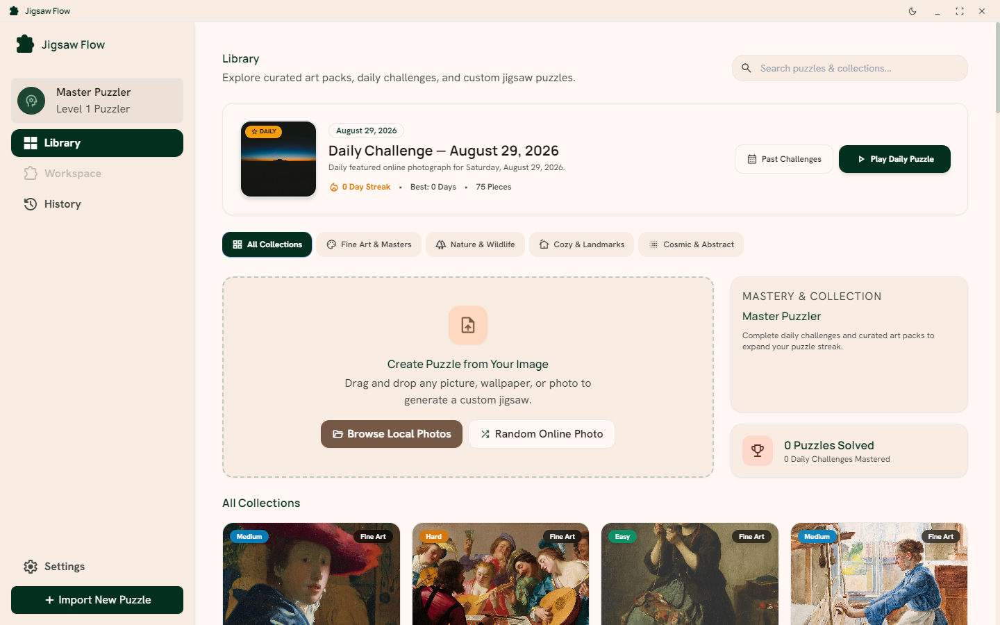
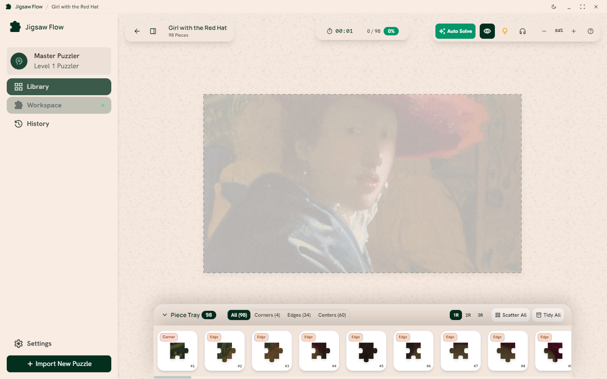
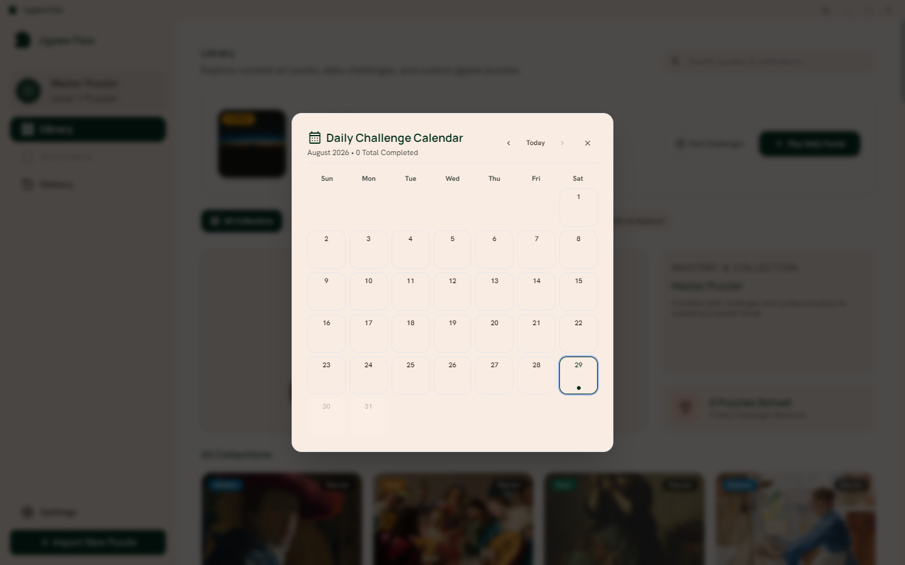
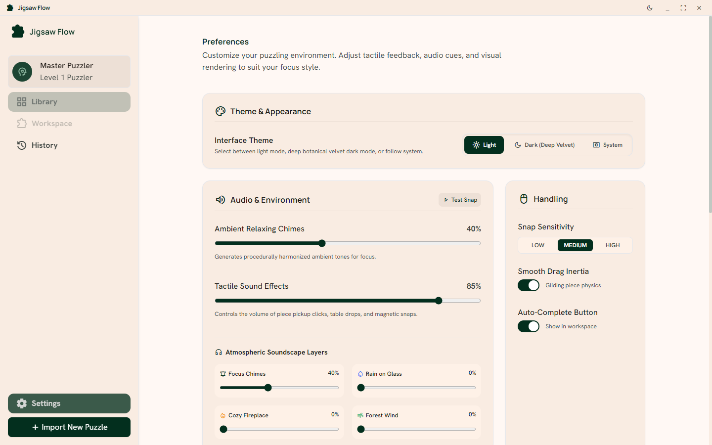

<p align="center">
  
  <h1 align="center">Jigsaw Flow</h1>
  <p align="center">A modern, tactile desktop jigsaw puzzle studio built with Electron, React, TypeScript, and HTML5 Canvas.</p>
</p>

<p align="center">
  
  
  
</p>

---

## Overview

**Jigsaw Flow** transforms any high-resolution image into an authentic, tactile jigsaw puzzle experience on your desktop. Built with an optimized multi-layer canvas pipeline, parametric Bezier curve slicing, and Disjoint-Set Union (DSU) clustering physics, it delivers a responsive tabletop puzzle environment with procedural ambient soundscapes, daily challenges, and custom image support.

---

## App Preview

### Workspace & Solving Table
*Tactile puzzle board with scattered pieces, organic Bezier cuts, reference ghost overlay, and floating toolbar controls.*

<p align="center">
  
</p>

---

### Library & Daily Challenge
*Explore curated art packs, play the daily featured challenge, track streaks, or discover random online photos.*

<p align="center">
  
</p>

---

### Smart Piece Organizer Tray
*Collapsible organizer tray categorizing loose pieces into All, Corners, Edges, and Centers.*

<p align="center">
  
</p>

---

### Daily Challenge Calendar & Streak Tracker
*Interactive monthly calendar to track your solve streak and replay past challenges anytime.*

<p align="center">
  
</p>

---

### Preferences, Soundscapes & Auto-Updates
*Customize procedural soundscapes (Rain, Fireplace, Wind, Chimes), Discord Rich Presence, and table felt surfaces.*

<p align="center">
  
</p>

---

## Key Features

### Gameplay & Physics Engine
* **Parametric Bezier Slicing:** Generates interlocking tabs and blanks using mathematically computed curves for organic, unique puzzle pieces.
* **DSU Cluster Physics:** Snapped pieces join into cohesive groups using Disjoint-Set Union data structures, allowing connected clusters to move, drag, and rotate as single units.
* **Magnetic Snapping & Grounding:** Pieces near matching neighbors or their correct board positions magnetically snap into place and lock permanently to the board upon correct placement.
* **Multi-Layer Rendering Pipeline:** Discrete canvas rendering passes for the tabletop background, ghost reference overlay, grounded board pieces, loose table pieces, and active dragging selections for maximum frame rates.
* **Cursor-Anchored Viewport:** Smooth panning and zooming centered precisely around your mouse cursor.

### Atmosphere & Procedural Soundscapes
* **4-Channel Ambient Mixer:** Synthesize real-time focus soundscapes including **Focus Chimes**, **Rain on Glass**, **Cozy Fireplace**, and **Forest Wind** with zero external audio assets.
* **Atmosphere Presets:** Quick 1-click presets for *Zen Garden*, *Rainy Study*, *Cozy Cabin*, and *Night Storm*.
* **Tactile Audio Effects:** Dynamic clicks, pickup cues, and snap sounds synthesized procedurally via the Web Audio API.

### Progression & Daily Challenges
* **Daily Featured Challenge:** Play a new date-seeded online challenge puzzle every day.
* **Monthly Calendar:** Browse and replay past daily challenges anytime.
* **Streak Tracking:** Earn and build your daily puzzle streak with persistent stats.
* **Organized Collections:** Browse curated categories including Fine Art & Masters, Nature & Wildlife, Cozy & Landmarks, and Cosmic & Abstract.

### Workspace & Custom Puzzles
* **Custom Image Importer:** Drag and drop any image file (PNG, JPG, WEBP, BMP) to generate custom jigsaw puzzles with customizable piece counts and aspect ratios.
* **Random Online Discovery:** Generate random online high-resolution puzzles on demand.
* **Smart Organizer Tray:** Collapsible bottom tray categorizing loose pieces into Corners, Edges, and Centers.
* **Ghost Reference Overlay:** Adjustable opacity guide overlay for visual assistance while solving.
* **Discord Rich Presence:** Real-time puzzle title, piece count, and elapsed solve timer display on your Discord profile.
* **Integrated Auto-Updater:** Seamless in-app update checks and 1-click background installer download.

---

## Installation (Windows)

### Option 1: Setup Installer (Recommended)
1. Download [`Jigsaw-Flow-Setup-1.0.3.exe`](https://github.com/KHOJAH/Jigsaw-Flow/releases/latest).
2. Run the installer (installs directly into your user profile with no Administrator UAC prompt required).
3. Launch **Jigsaw Flow** from your Desktop or Start Menu.

### Option 2: Portable Executable
Launch `release/win-unpacked/Jigsaw Flow.exe` directly without installing.

---

## Controls & Keyboard Shortcuts

| Action | Shortcut / Gesture |
| :--- | :--- |
| **Pan Canvas** | `Space + Drag` or `Middle Click + Drag` |
| **Zoom In / Out** | `Mouse Wheel` (cursor-anchored) |
| **Rotate Piece / Cluster** | `R` key or `Double Click` |
| **Toggle Organizer Tray** | `T` key |
| **Smart Hint** | `H` key |
| **Multi-Select** | `Shift + Drag` (Marquee Selection Box) |
| **Pick Up & Drag** | `Left Click + Drag` |
| **Reset View to Center** | `C` key |

---

## Building from Source

### Prerequisites
* Node.js (v18 or higher)
* npm (v9 or higher)

### Setup & Development

```bash
# Clone the repository
git clone https://github.com/KHOJAH/Jigsaw-Flow.git
cd Jigsaw-Flow

# Install dependencies
npm install

# Start development server with Electron window
npm run dev
```

### Production Packaging

```bash
# Compile and build the Windows NSIS Setup installer
npm run dist

# Build unpacked standalone directory only
npm run dist:dir
```

The output installer will be generated inside the `release/` directory.

---

## Tech Stack

* **Desktop Framework:** [Electron](https://www.electronjs.org/)
* **User Interface:** [React](https://react.dev/) + [TypeScript](https://www.typescriptlang.org/)
* **Styling:** [Tailwind CSS](https://tailwindcss.com/)
* **Graphics Engine:** HTML5 2D Canvas with sub-pixel rendering
* **Audio Engine:** Web Audio API Procedural Synthesis
* **Build Tooling:** [Vite](https://vitejs.dev/) + [electron-builder](https://www.electron.build/)

---

## License

This project is licensed under the MIT License.